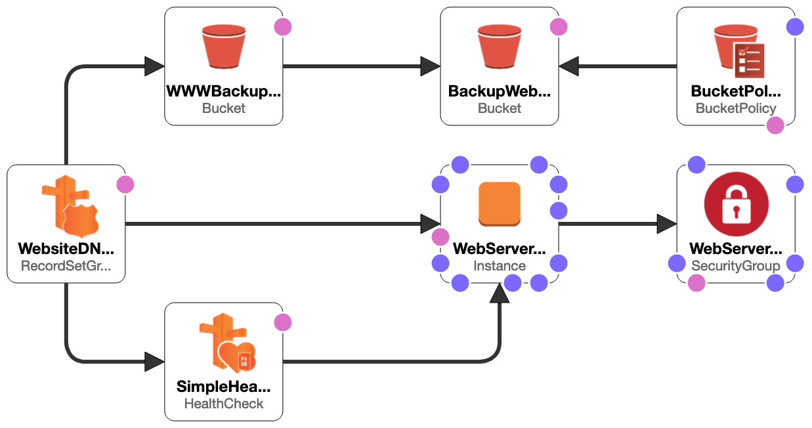

# Route53

## Architecture overview



### Key Route53 features that I research in this repo

**DNS Failover** - Automatically route your website visitors to an alternate location to avoid site outages.
**Health Checks and Monitoring** - Amazon Route 53 can monitor the health and performance of your application as well as your web servers and other resources.
As you can see in the diagram above, there are two DNS A records for the same address and pointing to different resources, S3 and EC2. The record pointing to the EC2 is a primary one, and S3 is secondary. When EC2 fails for unknown reason, route53 will notice that with use of health checks set up earlier, and change value for the A record to point to S3 instead of EC2 as a backup option.
You can see this in action on this gif:


## Parameters

In this repo you can find parameters.enc.json file which containes encrypted data for the real parameters.json file. Unencrypted it looks like this:
```json
[
  {
    "ParameterKey": "HostedZoneId",
    "ParameterValue": "abcd123456789"
  },
  {
    "ParameterKey": "RootDomainName",
    "ParameterValue": "mastering-route53.budelewski.com"
  }
]
```

This file is encrypted using mozilla sops tool. To learn more [click here](https://github.com/mozilla/sops)

**Instructions**
```bash
# Encrypt parameters file
sops --encrypt --input-type binary --kms "arn:aws:kms:eu-west-1:702707802422:key/042938cb-48ba-4f1c-a558-3c8225ac38e7" parameters.json > parameters.enc.json

# Decrypt parameters file
sops --decrypt --output-type binary parameters.enc.json > parameters.json
```


## Infrastructure as code

Resources are coded with CloudFormation. It's a native AWS IaC tool that allows you to define the infrastructure using json/yaml and view the deployment process and it's results in AWS console.

**Instructions**
```bash
# Create stack - deploy
aws cloudformation create-stack --stack-name mastering-route53 --template-body file://mastering-route53.yaml --parameters file://parameters.json
```

After creating stack, you should be able to add index.html file that will be displayed when opening the configured DNS A record in CloudFormation template.

```bash
# Get bucket name from the cloudformation stack output variables
bucket_name=$(aws cloudformation describe-stacks --stack-name mastering-route53 --query "Stacks[0].Outputs[?OutputKey=='BucketName'].OutputValue" --output text)

# Upload index.html to S3
aws s3 cp index.html s3://$bucket_name/index.html
```


## ToDo

- [] Add Elastic IP to EC2 instance.


