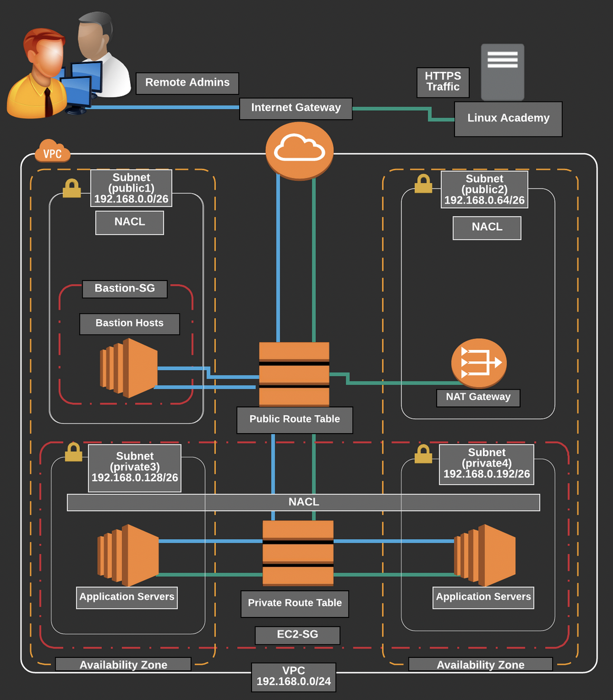

# VPC

## Architecture diagram

<p align="center"></p>

## Requirements

```bash
# Setup AWS access
export AWS_ACCESS_KEY_ID=
export AWS_SECRET_ACCESS_KEY=
export AWS_DEFAULT_REGION=

# Create bucket to store tf state
aws s3api create-bucket --bucket "terraform-state-bucket-mastering-aws-vpc" --region $AWS_DEFAULT_REGION

# Create ssh key
aws ec2 create-key-pair --key-name "mastering-aws" --region $AWS_DEFAULT_REGION --query 'KeyMaterial' --output text > mastering-aws.pem && chmod 400 mastering-aws.pem
```

## Provisioning

```bash
terraform init
terraform plan
terraform apply
```


